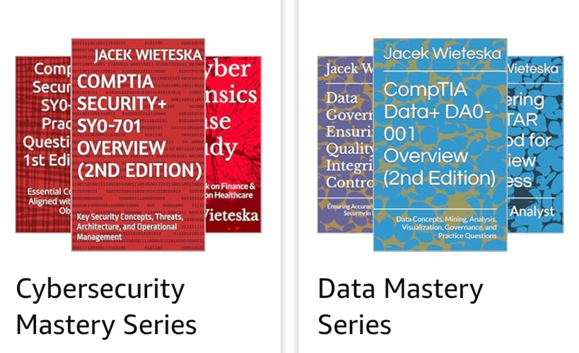
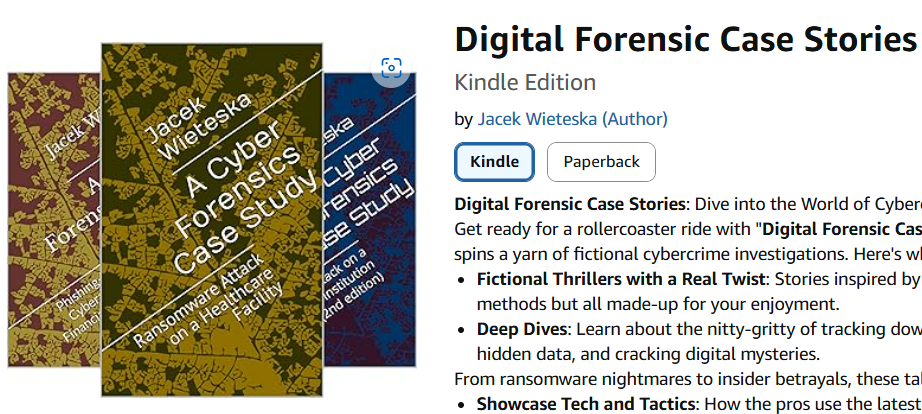
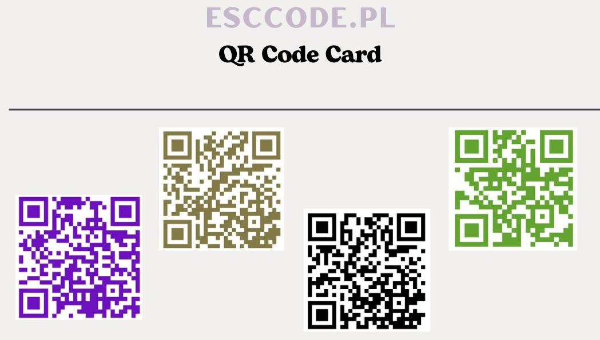
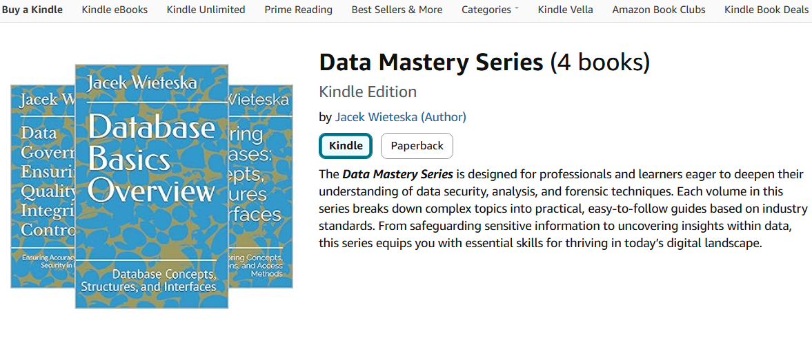
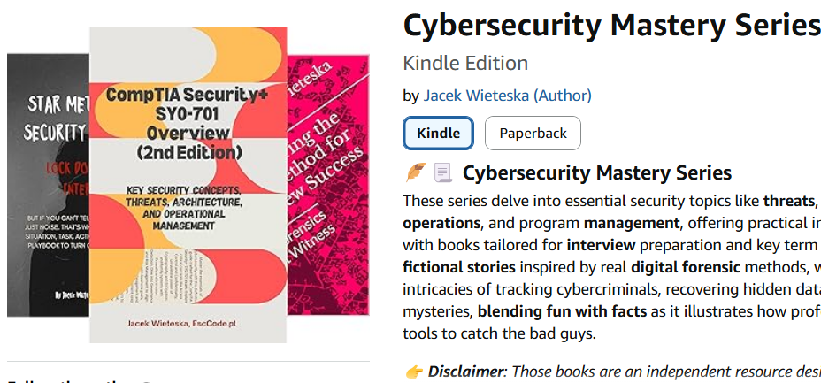
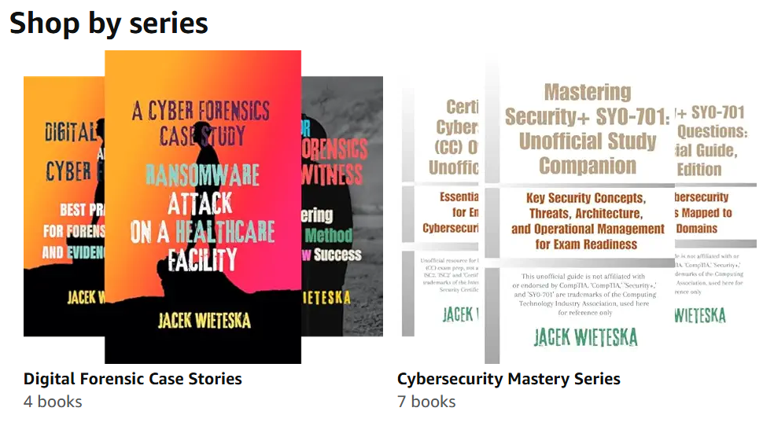
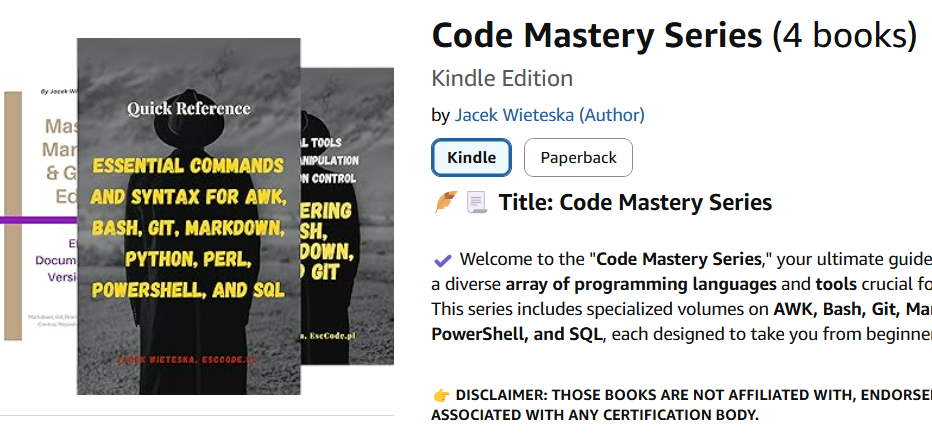
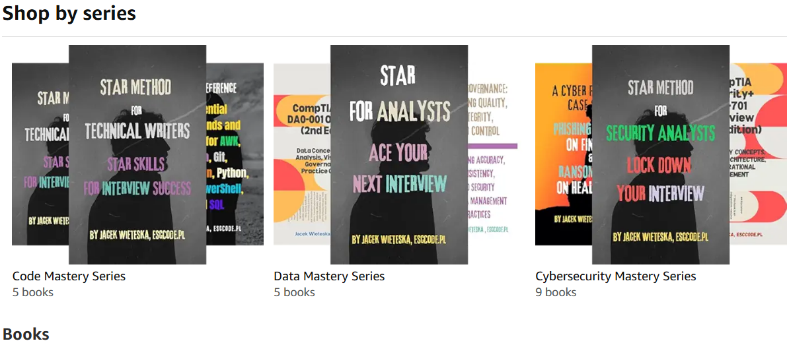

- [eBooks Series](#ebooks-series)
- [Training Status](#training-status)
- [Credly Profile](#credly-profile)

#### eBooks Series
<!-- >  -->
<!--  -->
<!-- >  -->
<!-- >  -->
<!-- >  -->
> 
<!--  -->
<!-- 

 -->

#### Training Status

<!-- > UNIC Institute for the future [Free MOOC on Mastering Web3](https://www.unic.ac.cy/iff/education-and-training/free-courses-moocs/mastering-web3-blockchain-cryptocurrencies-nfts-and-the-metaverse/)   -->
> CompTIA CySA+ CS0-003 [Exam Objectives ](https://www.comptia.org/certifications)  
> ISC2 SSCP [Exam Objectives ](https://www.isc2.org/certifications/sscp)  
>
> Training status doesn't guarantee I'll pass or even take the exam;
> it means I'm actively studying and preparing.
<!-- > ISC2 [ISC2 Certified in Cybersecurity Entry-Level Certification ](https://www.isc2.org/certifications/cc)   -->

#### Credly Profile

> [Badge Portfolio](https://www.credly.com/users/jacek-wieteska)
<!-- > 

 -->

<!-- #### QR Codes

>  -->

---
<!-- 

<!-- markdown content for cookie -->

